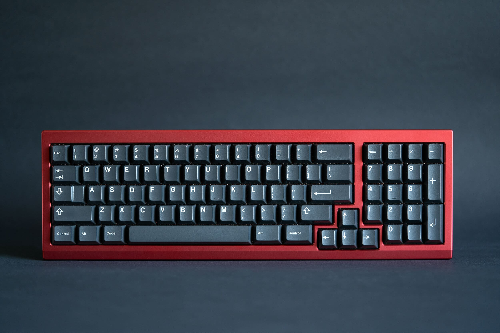

> [!CAUTION]
> These files are ${\textsf{\color{red}NOT COMPATIBLE}}$ with the [group buy](https://geekhack.org/index.php?topic=122694.0) board. 

# AKB Petrichor Prototype Rounds

The smell of dust after rain(e).

* [Website](https://alchemistkeyboards.com/projects/keyboards/petrichor/)

## Specifications

* 8 degree typing angle
* Full 6063 Aluminium construction
* Isolation gasket mount
* USB-C PCB, based on the open-source Cypher PCB from westfoxtrot/cablecardesigns
* Standard and HHKB top options
* MX-compatible only
* Unbuilt weight of 1.6kg/3.5lbs
* Laser engraved AKB logo on the bottom, and alchemical symbol for
* Earth above the usb port
* Pronounced seam in the vintage Cherry style
